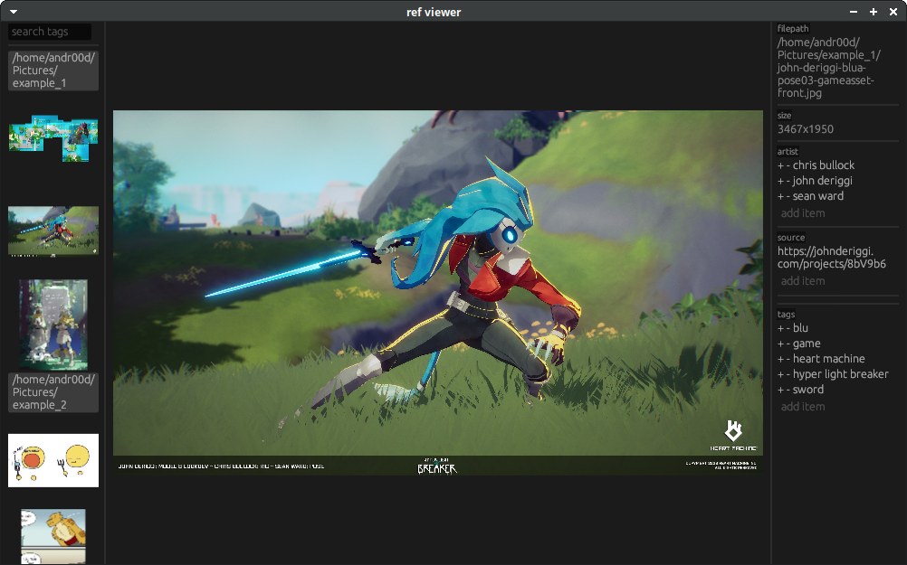

# ref viewer
Ref viewer is a simple image viewer using rust and [egui](https://github.com/emilk/egui). it has the extra functionality to add tags, links, and artists to images and search folders based on these tags to easily find specific images. 

For now it is linux-ony but this will likely change in the future, as it should be easy to port over to windows. 

### layout
 

### installing
running the included install.sh script will build and install the program. in the case that either rust or exiftool have been installed yet this will fail. 

### usage
call ref_viewer with folder paths as arguments to view the images in that folder. 

### dependencies
ref viewer requires [exiftool](https://exiftool.org/) to be installed to run. 